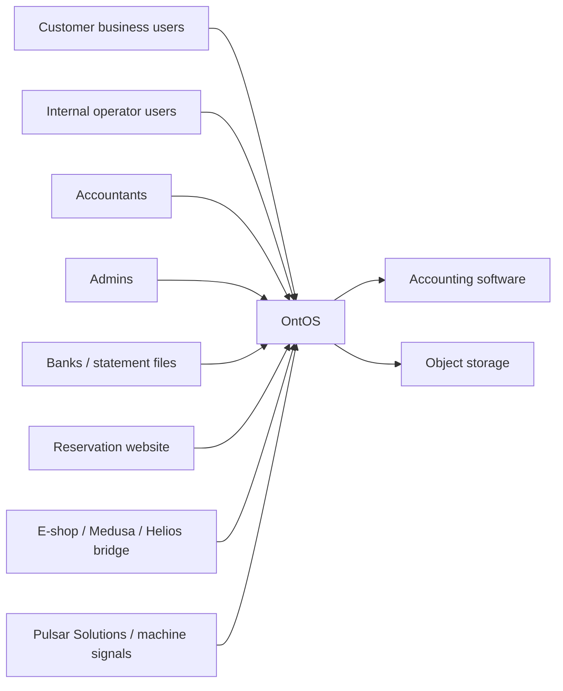

# C4 L1 Context

```mermaid
flowchart LR
  users[Customer business users]
  internal[Internal operator users]
  acct[Accountants]
  admin[Admins]
  ontos[OntOS]
  accsw[Accounting software]
  bank[Banks / statement files]
  resweb[Reservation website]
  shop[E-shop / Medusa / Helios bridge]
  pulsar[Pulsar Solutions / machine signals]
  storage[Object storage]

  users --> ontos
  internal --> ontos
  acct --> ontos
  admin --> ontos
  ontos --> accsw
  bank --> ontos
  resweb --> ontos
  shop --> ontos
  pulsar --> ontos
  ontos --> storage
```
