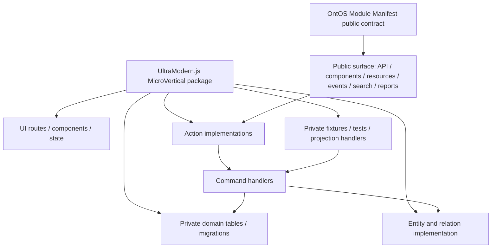

# C4 L3 MicroVertical-backed OntOS module

```mermaid
flowchart TB
  manifest[OntOS Module Manifest public contract]
  public[Public surface: API / components / resources / events / search / reports]
  package[UltraModern.js MicroVertical package]
  ui[UI routes / components / state]
  actions[Action implementations]
  handlers[Command handlers]
  domain[Private domain tables / migrations]
  ontology[Entity and relation implementation]
  internal[Private fixtures / tests / projection handlers]

  manifest --> public
  package --> ui
  package --> actions
  package --> domain
  package --> ontology
  package --> internal
  public --> actions
  actions --> handlers
  handlers --> domain
  handlers --> ontology
  internal --> handlers
```
