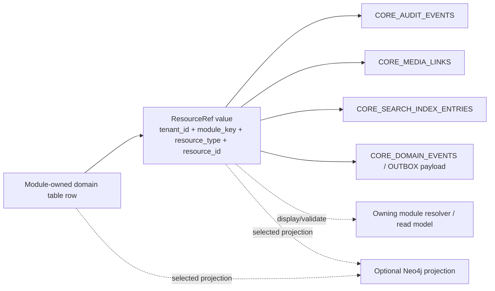

# ResourceRef Model

```mermaid
flowchart LR
  moduleTable["Module-owned domain table row"]
  resourceRef["ResourceRef value<br/>tenant_id + module_key + resource_type + resource_id"]
  audit["CORE_AUDIT_EVENTS"]
  media["CORE_MEDIA_LINKS"]
  search["CORE_SEARCH_INDEX_ENTRIES"]
  event["CORE_DOMAIN_EVENTS / OUTBOX payload"]
  resolver["Owning module resolver / read model"]
  neo["Optional Neo4j projection"]

  moduleTable --> resourceRef
  resourceRef --> audit
  resourceRef --> media
  resourceRef --> search
  resourceRef --> event
  resourceRef -. "display/validate" .-> resolver
  moduleTable -. "selected projection" .-> neo
  resourceRef -. "selected projection" .-> neo
```
