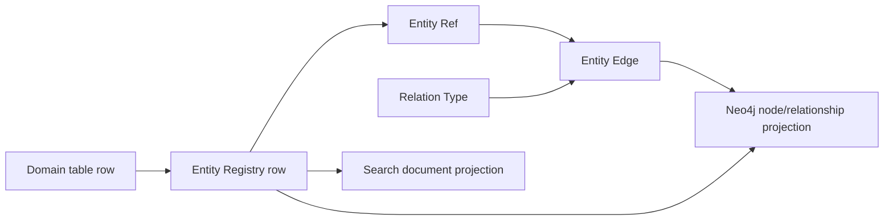

# Entity Model

```mermaid
flowchart LR
  dt[Domain table row]
  er[Entity Registry row]
  ref[Entity Ref]
  rt[Relation Type]
  edge[Entity Edge]
  neo[Neo4j node/relationship projection]
  search[Search document projection]

  dt --> er
  er --> ref
  ref --> edge
  rt --> edge
  edge --> neo
  er --> neo
  er --> search
```
