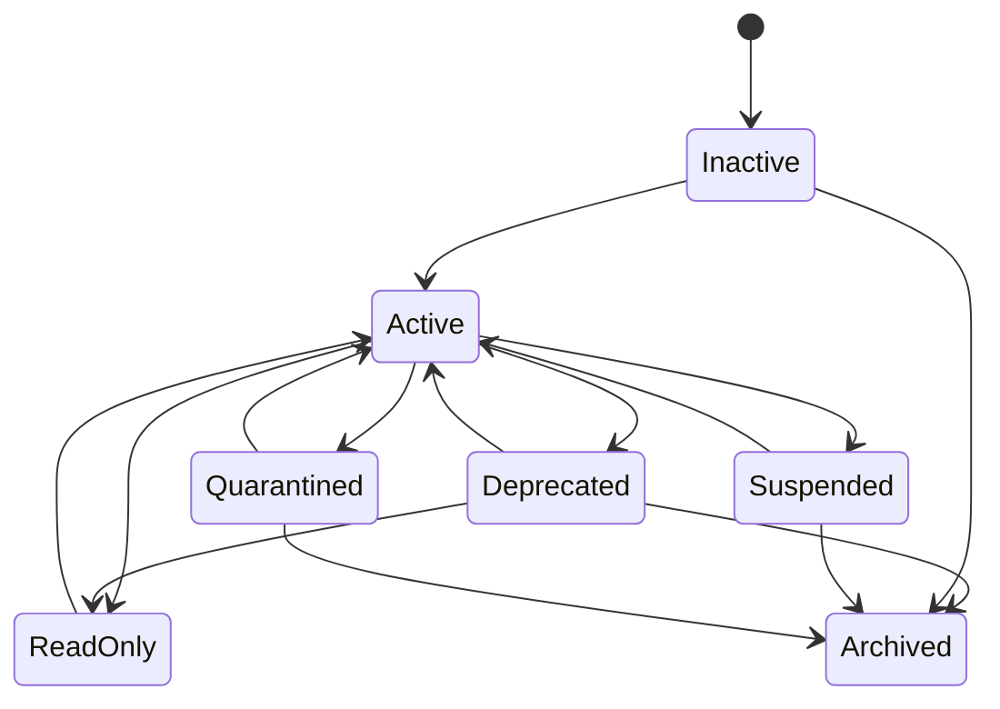

# Module Lifecycle

```mermaid
stateDiagram-v2
  [*] --> Inactive
  Inactive --> Active
  Active --> ReadOnly
  Active --> Suspended
  Active --> Quarantined
  ReadOnly --> Active
  Suspended --> Active
  Quarantined --> Active
  Active --> Deprecated
  Deprecated --> Active
  Deprecated --> ReadOnly
  Deprecated --> Archived
  Inactive --> Archived
  Suspended --> Archived
  Quarantined --> Archived
```
