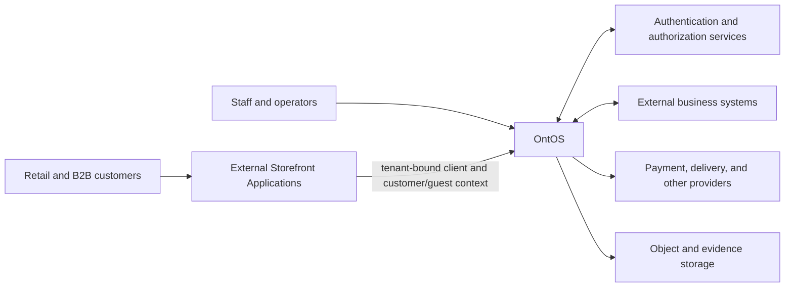

# C4 L1 Context

```mermaid
flowchart LR
  staff[Staff and operators]
  customers[Retail and B2B customers]
  ontos[OntOS]
  storefronts[External Storefront Applications]
  auth[Authentication and authorization services]
  business[External business systems]
  providers[Payment, delivery, and other providers]
  storage[Object and evidence storage]

  staff --> ontos
  customers --> storefronts
  storefronts -->|tenant-bound client and customer/guest context| ontos
  ontos <--> auth
  ontos <--> business
  ontos --> providers
  ontos --> storage
```
