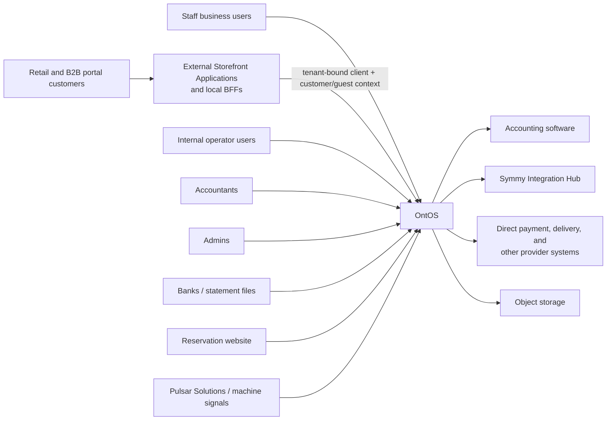

# C4 L1 Context

```mermaid
flowchart LR
  users[Staff business users]
  portal[Retail and B2B portal customers]
  internal[Internal operator users]
  acct[Accountants]
  admin[Admins]
  ontos[OntOS]
  accsw[Accounting software]
  bank[Banks / statement files]
  resweb[Reservation website]
  storefronts[External Storefront Applications\nand local BFFs]
  symmy[Symmy Integration Hub]
  providers[Direct payment, delivery, and\nother provider systems]
  pulsar[Pulsar Solutions / machine signals]
  storage[Object storage]

  users --> ontos
  portal --> storefronts
  storefronts -->|tenant-bound client + customer/guest context| ontos
  internal --> ontos
  acct --> ontos
  admin --> ontos
  ontos --> accsw
  bank --> ontos
  resweb --> ontos
  ontos --> symmy
  ontos --> providers
  pulsar --> ontos
  ontos --> storage
```
