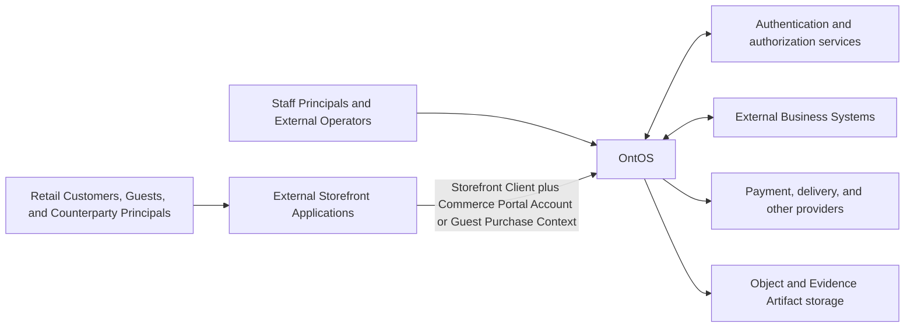

# C4 L1 Context

```mermaid
flowchart LR
  staff[Staff Principals and External Operators]
  commerceActors[Retail Customers, Guests, and Counterparty Principals]
  ontos[OntOS]
  storefronts[External Storefront Applications]
  auth[Authentication and authorization services]
  business[External Business Systems]
  providers[Payment, delivery, and other providers]
  storage[Object and Evidence Artifact storage]

  staff --> ontos
  commerceActors --> storefronts
  storefronts -->|Storefront Client plus Commerce Portal Account or Guest Purchase Context| ontos
  ontos <--> auth
  ontos <--> business
  ontos --> providers
  ontos --> storage
```
