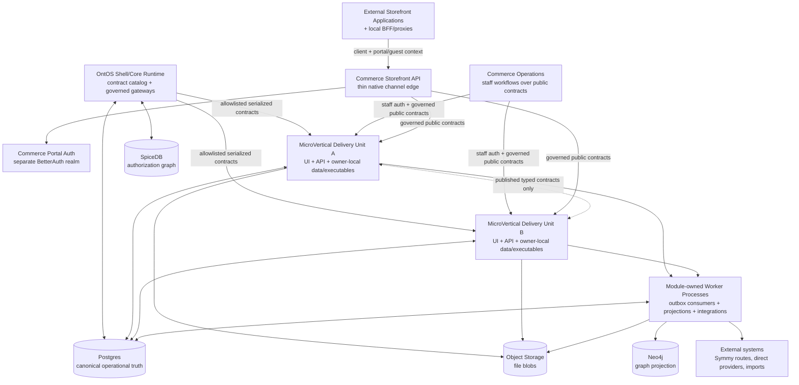

# C4 L2 Containers

```mermaid
flowchart TB
  shell[OntOS Shell/Core Runtime\ncontract catalog + governed gateways]
  operations[Commerce Operations\nstaff workflows over public contracts]
  commerceapi[Commerce Storefront API\nthin native channel edge]
  portalauth[Commerce Portal Auth\nseparate BetterAuth realm]
  storefronts[External Storefront Applications\n+ local BFF/proxies]
  mv1[MicroVertical Delivery Unit A\nUI + API + owner-local data/executables]
  mv2[MicroVertical Delivery Unit B\nUI + API + owner-local data/executables]
  workers[Module-owned Worker Processes\noutbox consumers + projections + integrations]
  pg[(Postgres\ncanonical operational truth)]
  neo[(Neo4j\ngraph projection)]
  sp[(SpiceDB\nauthorization graph)]
  obj[(Object Storage\nfile blobs)]
  ext[External systems\nSymmy routes, direct providers, imports]

  shell -->|allowlisted serialized contracts| mv1
  shell -->|allowlisted serialized contracts| mv2
  operations -->|staff auth + governed public contracts| mv1
  operations -->|staff auth + governed public contracts| mv2
  storefronts -->|client + portal/guest context| commerceapi
  commerceapi --> portalauth
  commerceapi -->|governed public contracts| mv1
  commerceapi -->|governed public contracts| mv2
  mv1 <-.->|published typed contracts only| mv2
  shell <--> pg
  shell <--> sp
  mv1 <--> pg
  mv2 <--> pg
  mv1 --> obj
  mv2 --> obj
  mv1 --> workers
  mv2 --> workers
  workers <--> pg
  workers --> neo
  workers --> ext
  workers --> obj
```
