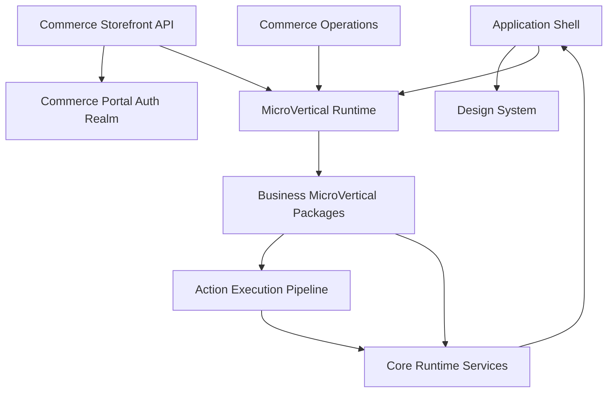

# C4 L3 Application Runtime

```mermaid
flowchart TB
  shell[Application Shell]
  operations[Commerce Operations]
  commerceapi[Commerce Storefront API]
  portalauth[Commerce Portal Auth Realm]
  mvrt[MicroVertical Runtime]
  core[Core Runtime Services]
  actions[Action Execution Pipeline]
  mvs[Business MicroVertical Packages]
  ds[Design System]

  shell --> ds
  shell --> mvrt
  operations --> mvrt
  commerceapi --> portalauth
  commerceapi --> mvrt
  mvrt --> mvs
  mvs --> actions
  actions --> core
  mvs --> core
  core --> shell
```
