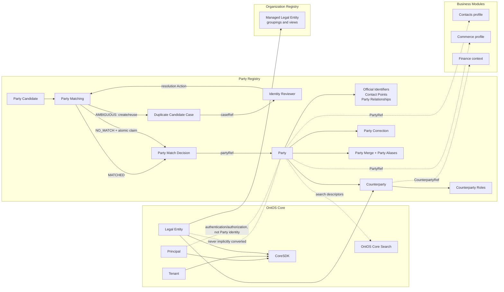

# Party Registry boundaries

Key invariants:

- Legal Entity, Party, Counterparty, and Principal are distinct Resources.
- Party creation claims strong identifiers in the canonical Party Registry transaction; search is
  never uniqueness authority.
- AMBIGUOUS commits one Party Match Decision and creates or reuses one Duplicate Candidate Case; it
  returns a caseRef instead of looping back to the Candidate.
- Consumer modules own profiles and workflows, not copies of shared Party identity.
- Party Merge is enabled only after consumer collision, reconciliation, and recovery behavior is
  tested.
