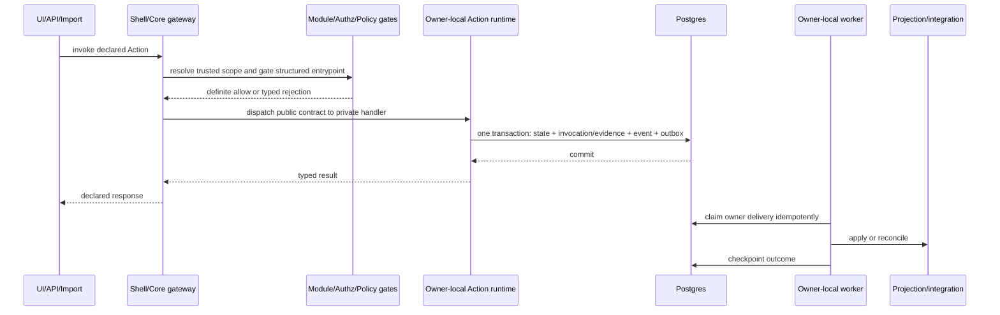

# Runtime Action Flow

```mermaid
sequenceDiagram
  participant Caller as UI/API/Import
  participant Core as Shell/Core gateway
  participant Gate as Module/Authz/Policy gates
  participant Owner as Owner-local Action runtime
  participant PG as Postgres
  participant Worker as Owner-local worker
  participant SideEffect as Projection/integration

  Caller->>Core: invoke declared Action
  Core->>Gate: resolve trusted scope and gate structured entrypoint
  Gate-->>Core: definite allow or typed rejection
  Core->>Owner: dispatch public contract to private handler
  Owner->>PG: one transaction: state + invocation/evidence + event + outbox
  PG-->>Owner: commit
  Owner-->>Core: typed result
  Core-->>Caller: declared response
  Worker->>PG: claim owner delivery idempotently
  Worker->>SideEffect: apply or reconcile
  Worker->>PG: checkpoint outcome
```
