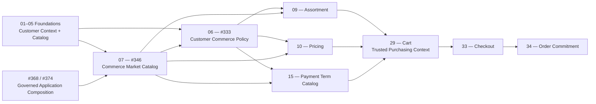

The roadmap says not to build Cart or Order early merely to make #333/#346 appear complete. They are steps 06–07; Cart is step 29 and Order Commitment is step 34. The correct approach is to finish their owner boundaries now and park downstream integrations at their actual roadmap steps.

The authoritative sequencing is the [current #253 roadmap comment](https://github.com/TechsioCZ/ontos/issues/253#issuecomment-5661414584), which explicitly uses Inventory as the precedent: downstream integration must not be pulled into an earlier owner step merely to satisfy cross-domain acceptance.

## Finalize #346 at step 07

Complete the Market owner itself:

- Replace the `Current Market Catalog` unavailable stub with a real persistence-backed Current read.
- Complete Market definition, immutable revisions, lifecycle, Storefront associations and authoritative eligible-tuple enumeration.
- Prove set completeness invalidation for inserts, removals, activation, suspension, retirement and subject-restriction changes.
- Prove every specified Market outcome, including `MARKET_SELECTION_REQUIRED`, without `AMBIGUOUS_MARKET`.
- Finish migrations, Czech configuration fixtures, audit/outbox evidence and operational diagnostics.
- Complete safe retirement using an authoritative runtime Application Composition read.

The last item should use the accepted provider-neutral platform architecture from [#368](https://github.com/TechsioCZ/ontos/issues/368) and [#374](https://github.com/TechsioCZ/ontos/issues/374). It must not become a Commerce-specific Core registry. Only the minimal server-side active-composition authority is required; the browser-loading work in #375–#377 is not a prerequisite for Market retirement.

Future Cart, Proposal and Order reference providers should be added when those owners are delivered. Application Composition must authoritatively prove that an absent provider is not installed; source-code or topology absence is insufficient.

## Finalize #333 at step 06

Complete the four accepted policy families only:

1. Market bootstrap over #346’s complete eligible set.
2. Purchase Currency allowed/default policy.
3. Payment Term applicability/fallback policy.
4. Commerce Quantity Rules and assignments over Catalog evidence.

Owner-level completion requires:

- Persisted immutable rules, revisions, assignments and governed lifecycle Actions.
- Production Current reads with typed currentness/completeness evidence.
- Real #346 integration for Market bootstrap.
- Real Catalog integration for Quantity.
- Currency and Payment Term policy semantics that produce constraints/candidates without claiming ownership of Pricing, Payment Terms or Cart.
- Acceptance for precedence, conflicts, missing configuration, stale evidence, dependency inability and concurrent material change.

Do not create Cart now. The real `Current Purchasing Context` adapter belongs to roadmap step 29. Until then, exposed purchase-resolution composition must remain fail-closed, while #333’s policy engine and owner contracts can still be completed and tested independently.

## Reclassify the seven currently blocked plan items

| Existing blocked work | Roadmap treatment |
|---|---|
| Cart purchasing-context adapter | Defer to step 29 Cart |
| Currency production wiring through Cart | Defer to step 29 |
| Full currency runtime proof | Split: owner-policy proof now; Cart integration later |
| Market retirement production proof | Deliver neutral Application Composition authority now |
| Retirement providers for future Cart/Order owners | Add with those downstream owners |
| All-owner composed acceptance harness | Split into owner acceptance now and purchase-flow E2E at steps 29–34 |
| Currency + Payment combined journey proof | Split across steps 10, 15 and 29 |

## PR and issue closure strategy

- Treat PR #885 as a foundational implementation slice, not proof that all downstream Commerce capabilities exist.
- Remove `Closes #333` and `Closes #346` until their owner-level acceptance is genuinely complete.
- Finish and merge #346 owner acceptance first, including the minimal authoritative Application Composition dependency.
- Finish #333 owner acceptance against the completed #346 and Catalog owners.
- Keep the downstream notes for Pricing, Payment Terms, Cart, Checkout and Order Commitment only in the frozen #333 and #346 issue bodies. Do not edit any other issue or create a new issue. Any future mutation of #333 or #346 requires explicit HITL approval first.
- Close #333 and #346 independently once their own production contracts, persistence, actions, failure semantics and owner-level acceptance pass. Do not wait for Cart or Order—but do not claim their future integrations are already operational.

Current GitHub state supports this interpretation: [#253](https://github.com/TechsioCZ/ontos/issues/253) is the open planning index, [#333](https://github.com/TechsioCZ/ontos/issues/333) and [#346](https://github.com/TechsioCZ/ontos/issues/346) are open and specified, Catalog [#398](https://github.com/TechsioCZ/ontos/issues/398) is closed, while the governed runtime-composition work remains open under #368/#374–#377.

The downstream notes are frozen in #333 and #346. No other issue may be edited and no new issue may be created; any future mutation of #333 or #346 requires explicit HITL approval first.
